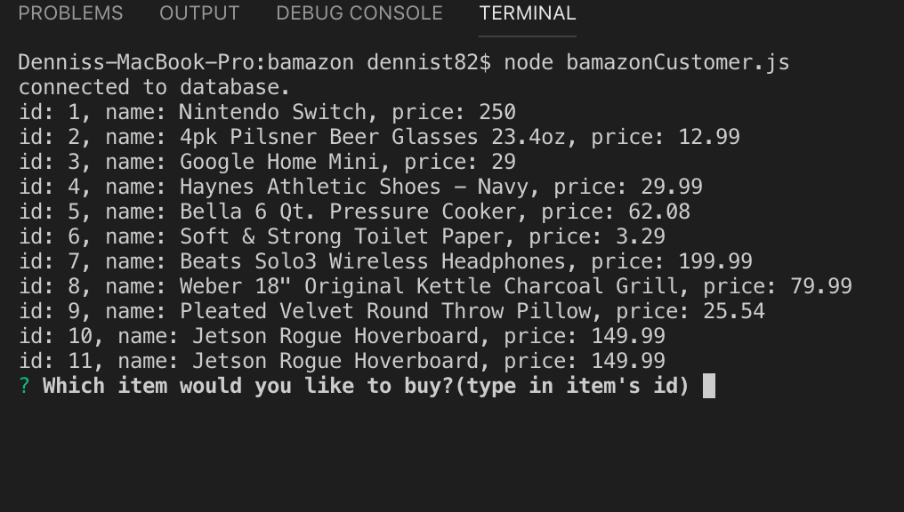
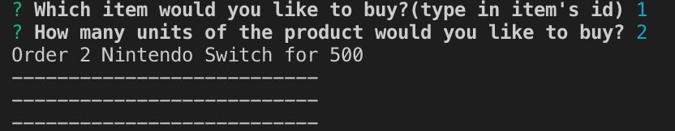
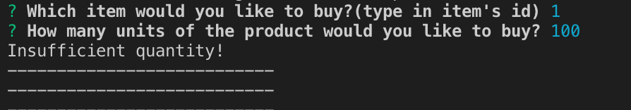

# bamazon
  Shop application that uses Mysql to retrieve and store product quantity. 
## Run app 
```
  node bamazonCustomer.js
```

## initial view
1. Load all items from products table



2. input item id and quantity.


If store have enough stocks in inventory, it will display total cost.
Else prompt "Insufficient quantity"


